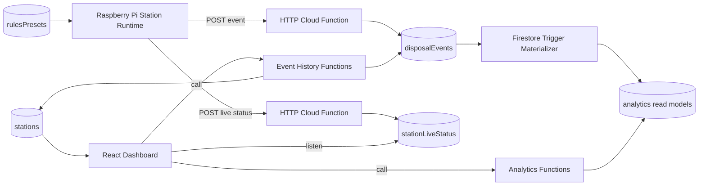

<!-- markdownlint-disable-file -->
# Task Research: Backend and Dashboard

Research the best approach for implementing the backend and dashboard for the BinBuddy smart waste-sorting station.

## Task Implementation Requests

* Define the recommended backend architecture for the smart station demo
* Define the recommended dashboard architecture for station insights and live monitoring
* Evaluate alternatives and select one approach that fits the repo and spec

## Scope and Success Criteria

* Scope: Backend and dashboard architecture, data flow, service boundaries, Firebase fit, monorepo integration points, and implementation guidance for the existing workspace. Excludes actual feature implementation.
* Assumptions:
  * The product behavior is governed by the project spec in spec/binbuddy-spec.md
  * Backend hosting should align with the existing Firebase direction unless evidence shows a stronger reason to deviate
  * The current monorepo packages are intended to be shared across device, backend, and dashboard surfaces where practical
<!-- markdownlint-disable-file -->
# Task Research: Backend and Dashboard

Research the best approach for implementing the backend and dashboard for the BinBuddy smart waste-sorting station.

## Task Implementation Requests

* Define the recommended backend architecture for the smart station demo
* Define the recommended dashboard architecture for station insights and live monitoring
* Evaluate alternatives and select one approach that fits the repo and spec
* Provide an implementation-oriented blueprint for the current monorepo

## Scope and Success Criteria

* Scope: Backend and dashboard architecture, Firestore data layout, Cloud Functions boundaries, dashboard page and module shape, and repo integration guidance. This excludes coding the solution.
* Assumptions:
  * The product behavior is defined by [spec/binbuddy-spec.md](../../../spec/binbuddy-spec.md#L1)
  * Firebase Firestore and Firebase Cloud Functions remain the default backend direction unless the spec changes
  * The Raspberry Pi continues to own the live control loop and cloud integration should not pull latency-sensitive guidance into the backend
* Success Criteria:
  * One recommended backend approach is selected with rationale and trade-offs
  * One recommended dashboard approach is selected with rationale and trade-offs
  * The selected approach is mapped to the current repo structure and contract layer
  * The document is actionable enough to hand off to planning or scaffolding

## Outline

* Confirm product and repo constraints
* Evaluate backend architecture options
* Evaluate dashboard architecture options
* Select one combined approach
* Describe implementation blueprint, Firestore layout, and next planning steps

## Potential Next Research

* Define exact endpoint contracts for ingestion, analytics, and event history
  * Reasoning: The architecture is clear, but the transport contract is still greenfield
  * Reference: [services/backend-functions/openapi/README.md](../../../services/backend-functions/openapi/README.md#L1)
* Define the first Firestore composite indexes after query shapes are finalized
  * Reasoning: Indexes are currently empty and the dashboard will require compound filters
  * Reference: [infra/firebase/firestore.indexes.json](../../../infra/firebase/firestore.indexes.json#L1)
* Evaluate whether the demo latest-frame camera transport should be upgraded to full-motion streaming
  * Reasoning: The planning package selects a bounded latest-frame path to keep live monitoring inside the Firebase-native architecture; revisit only if the demo requires full-motion video
  * Reference: [spec/binbuddy-spec.md](../../../spec/binbuddy-spec.md#L96-L101)

## Research Executed

### File Analysis

* [spec/binbuddy-spec.md](../../../spec/binbuddy-spec.md#L1)
  * The spec fixes the intended architecture: Pi-side on-device inference, Firestore as the database, Cloud Functions as the website backend, and dashboard requirements covering live monitoring, event history, metrics, filters, grouping, and comparisons
* [README.md](../../../README.md#L26-L29)
  * The repo root states that the Pi owns the live control loop and shared boundaries should be data-first rather than shared runtime logic
* [devices/pi-station/README.md](../../../devices/pi-station/README.md#L10-L15)
  * The Pi runtime is responsible for detection start, classification, rules evaluation, guidance, disposal detection, and event creation
* [services/backend-functions/README.md](../../../services/backend-functions/README.md#L8-L19)
  * The backend package is intended to own ingestion, validation, live status handling, analytics aggregation, and dashboard read models
* [apps/web/README.md](../../../apps/web/README.md#L8-L19)
  * The web app is intended to own station insights and live monitoring, but it is still a shell
* [infra/firebase/firebase.json](../../../infra/firebase/firebase.json#L3-L5)
  * Firebase is already wired to use `services/backend-functions` as the Functions codebase
* [infra/firebase/firestore.rules](../../../infra/firebase/firestore.rules#L3-L5)
  * Firestore currently denies all reads and writes, so browser-only Firestore access is not yet the default posture
* [packages/contracts/schemas/domain/disposal-event.schema.json](../../../packages/contracts/schemas/domain/disposal-event.schema.json#L9-L57)
  * The canonical event contract is richer and differently shaped than the current Python event dataclass
* [packages/contracts/schemas/domain/live-station-status.schema.json](../../../packages/contracts/schemas/domain/live-station-status.schema.json#L9-L121)
  * The canonical live status contract supports richer operator-facing monitoring than the current Python publisher emits
* [devices/pi-station/src/binbuddy_station/events.py](../../../devices/pi-station/src/binbuddy_station/events.py#L11-L19)
  * The Pi currently emits `success: bool`, which does not match the canonical `attemptResult` enum shape
* [devices/pi-station/src/binbuddy_station/live_status.py](../../../devices/pi-station/src/binbuddy_station/live_status.py#L9-L24)
  * The Pi currently emits a minimal live status shape, so backend normalization is required before the dashboard can rely on the canonical contract

### Code Search Results

* Backend ownership and Firebase boundary
  * Verified in [services/backend-functions/README.md](../../../services/backend-functions/README.md#L8-L19), [infra/firebase/firebase.json](../../../infra/firebase/firebase.json#L3-L5), and [spec/binbuddy-spec.md](../../../spec/binbuddy-spec.md#L142-L144)
* Dashboard ownership and live-monitoring requirements
  * Verified in [apps/web/README.md](../../../apps/web/README.md#L8-L19) and [spec/binbuddy-spec.md](../../../spec/binbuddy-spec.md#L96-L114)
* Contract drift between Python and canonical schemas
  * Verified in [devices/pi-station/src/binbuddy_station/events.py](../../../devices/pi-station/src/binbuddy_station/events.py#L11-L19), [devices/pi-station/src/binbuddy_station/live_status.py](../../../devices/pi-station/src/binbuddy_station/live_status.py#L9-L24), [packages/contracts/schemas/domain/disposal-event.schema.json](../../../packages/contracts/schemas/domain/disposal-event.schema.json#L33-L57), and [packages/contracts/schemas/domain/live-station-status.schema.json](../../../packages/contracts/schemas/domain/live-station-status.schema.json#L73-L121)
* Workspace readiness and current scaffolding
  * Verified in [apps/web/src/index.ts](../../../apps/web/src/index.ts#L1-L4), [services/backend-functions/src/index.ts](../../../services/backend-functions/src/index.ts#L1-L4), and [pnpm-workspace.yaml](../../../pnpm-workspace.yaml#L1-L4)

### External Research

* Firebase docs: [Choose a data structure](https://firebase.google.com/docs/firestore/manage-data/structure-data)
  * Firestore favors root-level collections when query patterns need cross-parent reads, which fits disposal events, live status, and analytics views better than deep station subcollections
* Firebase docs: [Get realtime updates with Cloud Firestore](https://firebase.google.com/docs/firestore/query-data/listen)
  * Firestore listeners are a strong fit for live operator views and current station state
* Firebase docs: [Summarize data with aggregation queries](https://firebase.google.com/docs/firestore/query-data/aggregation-queries)
  * Native Firestore aggregation covers only `count`, `sum`, and `average`, is not realtime, and is therefore insufficient for the full dashboard KPI set
* Firebase docs: [Cloud Firestore triggers](https://firebase.google.com/docs/functions/firestore-events)
  * Firestore trigger processing is at-least-once and unordered, so analytics materialization must be idempotent
* Firebase docs: [Call functions via HTTP requests](https://firebase.google.com/docs/functions/http-events)
  * HTTP functions are the appropriate ingress boundary for a non-Firebase client such as the Raspberry Pi
* Firebase docs: [Call functions from your app](https://firebase.google.com/docs/functions/callable)
  * Callable functions are a good fit for dashboard-side analytics and admin actions when the web app already uses Firebase auth
* Firebase docs: [Perform simple and compound queries](https://firebase.google.com/docs/firestore/query-data/queries)
  * Multi-dimensional Firestore query limits reinforce keeping event history and analytics query orchestration in the backend
* ECharts docs: [Dataset](https://echarts.apache.org/handbook/en/concepts/dataset/) and [Data Transform](https://echarts.apache.org/handbook/en/concepts/data-transform/)
  * ECharts is a strong charting fit for grouped trends, leaderboard slices, and comparison views because it supports reusable datasets and built-in transforms

### Project Conventions

* Standards referenced: BinBuddy product spec, markdown instructions, writing style instructions, Task Researcher workflow
* Instructions followed: Treat the spec as the source of truth, keep the Pi authoritative for the live loop, keep the repo schema-first, and avoid implementation outside `.copilot-tracking/research/`

## Key Discoveries

### Project Structure

The repo is intentionally split by surface.

* `devices/pi-station` owns live sensing, classification, rules evaluation, guidance, disposal detection, and event creation
* `services/backend-functions` is the intended Firebase backend surface but is still scaffold-level
* `apps/web` is the intended dashboard surface but is also scaffold-level
* `packages/contracts/schemas` is the most mature shared boundary in the repo and should be treated as the canonical cross-surface vocabulary

The most important structural constraint is that the Pi runtime and the TypeScript workspace are separate systems. That makes schema-first adapters more important than shared business logic libraries.

### Implementation Patterns

The best pattern for this product is a hybrid split.

* Keep latency-sensitive decision-making on the Pi
* Use Cloud Functions as the trusted ingestion and analytics boundary
* Use Firestore as the canonical event store, live-status store, and analytics read-model store
* Let the dashboard read bounded live state directly from Firestore, but keep analytics and filtered history behind backend APIs

This pattern matches both the spec and Firestore's actual strengths and limits.

### Complete Examples

```text
Pi runtime
  -> POST /ingest/event            -> Cloud Function validates + normalizes -> Firestore disposalEvents
  -> POST /ingest/live-status      -> Cloud Function validates + upserts    -> Firestore stationLiveStatus

Firestore on event create
  -> analytics materializer trigger -> Firestore analytics* read models

Dashboard
  -> Firestore listener on stationLiveStatus/{stationId}
  -> Cloud Function getAnalyticsSummary(query)
  -> Cloud Function getEventHistory(query)
```

### API and Schema Documentation

The contract layer is already enough to define the backbone of the system, even though the runtime code is not wired yet.

* `DisposalEvent` is the canonical immutable telemetry event for each attempt
* `LiveStationStatus` is the canonical live snapshot contract for operators
* `StationMetadata` holds the grouping and filtering dimensions the dashboard needs
* `AnalyticsQuery` and `AnalyticsSummary` define the analytics request and read-model boundary

The repo risk is not missing schema intent. The risk is contract drift between the Python runtime and those schemas.

### Configuration Examples

```text
Canonical Firestore collections

stations/{stationId}
rulesPresets/{presetKey}
stationLiveStatus/{stationId}
disposalEvents/{eventId}
analyticsStationDay/{stationId_yyyymmdd}
analyticsFloorDay/{buildingId_floorId_yyyymmdd}
analyticsBuildingDay/{buildingId_yyyymmdd}
analyticsExperimentDay/{dimension}_{value}_{yyyymmdd}
```

## Technical Scenarios

### Recommended End-to-End Architecture

Use a Firebase-native backend-for-frontend architecture with a hybrid dashboard data path.

**Requirements:**

* Preserve the Pi as the owner of classification, guidance, and disposal detection
* Support low-latency live monitoring for operators
* Support historical event history and multi-dimensional analytics for the dashboard
* Align with the current monorepo, spec, and shared contract layer
* Avoid pushing Firestore query complexity and analytics composition into the browser

**Preferred Approach:**

* Backend: authenticated HTTP Cloud Functions for device ingress, Firestore-triggered analytics materialization, and callable or HTTP functions for dashboard analytics and event-history APIs
* Data: root-level canonical Firestore collections for station metadata, rules presets, live status, raw events, and materialized analytics views
* Dashboard: React SPA in `apps/web` with direct Firestore listeners only for live status and backend API calls for analytics, comparisons, and event history
* Camera feed: for the demo path, authenticated latest-frame uploads from the Pi into Firebase Storage with frame reference metadata carried in live status; revisit full-motion streaming only if demo requirements outgrow that bounded approach

```text
Recommended package/module layout

services/backend-functions/
  src/
    index.ts
    functions/
      ingest-event.ts
      ingest-live-status.ts
      get-analytics-summary.ts
      get-event-history.ts
      get-station-directory.ts
    domain/
      contracts.ts
      normalization.ts
      validation.ts
    firestore/
      collections.ts
      converters.ts
      repositories/
    analytics/
      materializers/
      mappers/
      query-service.ts
    auth/
      device-auth.ts
      operator-auth.ts

apps/web/
  src/
    app/
      router.tsx
      providers.tsx
      layout.tsx
    features/
      stations/
      live/
      events/
      analytics/
      comparisons/
      filters/
    lib/
      firebase/
      api/
      query/
    pages/
      stations.tsx
      station-detail.tsx
      live.tsx
      analytics.tsx
      compare.tsx
```



**Implementation Details:**

The backend should act as a normalization boundary first, not a thin pass-through. The Python runtime currently emits payloads that do not exactly match the canonical JSON Schemas, so the ingestion layer should validate and map device payloads into canonical event and live-status documents before persistence.

The Firestore layout should avoid station-scoped nested event collections as the default design. Cross-station analytics and grouped comparison views are first-class product requirements, so root-level collections and materialized day-bucket views are the more practical fit.

The dashboard should separate live and historical concerns at the feature boundary. Live monitoring benefits directly from Firestore listeners. Historical charts, comparisons, and paginated event history should go through backend APIs because the required query shapes exceed what Firestore alone handles cleanly in the browser.

The camera feed should start as a bounded demo transport rather than a dedicated streaming subsystem. The Pi can upload only the latest active JPEG frame, the backend can overwrite a single station-scoped Storage object plus update live-status metadata, and the dashboard can render that current frame with stale-state handling. This keeps the implementation inside the Firebase-native stack already selected for the project. Full-motion streaming remains follow-on work only if the demo specifically requires it.

```ts
// Dashboard-side service boundary example
type DashboardDataAccess = {
  listenToStationLiveStatus: (stationId: string) => () => void;
  getAnalyticsSummary: (query: AnalyticsQuery) => Promise<AnalyticsSummary>;
  getEventHistory: (query: EventHistoryQuery) => Promise<PaginatedEventHistory>;
};
```

#### Considered Alternatives

Option 1: Thin browser-only Firestore dashboard

Rejected because the product requires grouped analytics, comparisons, and metadata-heavy filtering that do not fit cleanly into direct browser Firestore queries. Firestore rules are also currently deny-all, and the spec already assigns the backend role to Cloud Functions.

Option 2: Full backend-proxied dashboard with no direct Firestore listeners

Rejected because it gives up Firestore's strongest live feature for operator monitoring and adds unnecessary proxy latency and complexity for rapidly changing station status.

Option 3: Move more business logic from the Pi into Cloud Functions

Rejected because the spec and repo both assign the live control loop to the Pi. Cloud round trips would make classification, guidance, and disposal-session completion more fragile and slower in the most user-visible path.

## Recommended Next Steps for Planning

* Define canonical ingestion request contracts and idempotency behavior for event and live-status writes
* Define Firestore document shapes for raw events, live status, station metadata, and analytics rollups
* Decide whether dashboard server calls should start as callable functions, HTTP functions, or a mixed interface
* Align the Python runtime payloads with the canonical contracts or formalize the backend normalization mapping
* Scaffold `apps/web` as a React SPA and `services/backend-functions` as a Firebase Functions package around the module layout above
