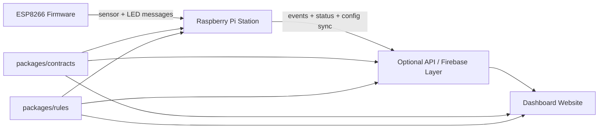

<!-- markdownlint-disable-file -->
# Task Research: Project Foundation, Shared Contracts, and Repo Structure

Research the best approach for implementing the project foundation, shared contracts, and repository structure for the BinBuddy smart waste-sorting station, including a top-level folder layout that clearly separates the website, Raspberry Pi code, ESP8266 firmware, and any backend or shared code.

## Task Implementation Requests

* Define the best initial project foundation for the smart waste-sorting station.
* Recommend a shared-contracts strategy across the website, Raspberry Pi code, ESP8266 firmware, and any backend or shared code.
* Recommend a repository structure with clear top-level separation between product surfaces and shared assets.
* Evaluate alternatives and select a single recommended approach grounded in the project spec and implementation constraints.

## Scope and Success Criteria

* Scope: Project setup and monorepo structure, shared contracts, cross-component boundaries, build/tooling implications, and initial foundation decisions aligned to the spec. Excludes full implementation of product features.
* Assumptions:
	* The authoritative product scope is defined by the spec at `/spec/binbuddy-spec.md`.
	* The repository is currently minimal and does not yet contain implemented application code.
	* The foundation should support separate deployment targets: website, Raspberry Pi, and ESP8266 firmware.
	* A backend may exist either on the Raspberry Pi, as a separate service, or both, depending on the selected architecture.
* Success Criteria:
	* Provide one recommended top-level folder layout with rationale.
	* Identify how shared contracts should be defined, versioned, and consumed by each component.
	* Evaluate at least two viable architectural alternatives and explain why one is preferred.
	* Include implementation-ready examples, risks, and next steps.

## Outline

1. Spec constraints and runtime boundaries.
2. Shared-contract boundaries and compatibility model.
3. Monorepo layout alternatives.
4. Selected approach and implementation details.
5. Follow-up decisions for planning.

## Potential Next Research

* Decide the Raspberry Pi runtime language.
	* Reasoning: Python keeps camera and inference workflows natural, but Node.js would change how tightly the Pi code participates in the JS workspace.
	* Reference: spec requires Raspberry Pi 5, camera, LCD, and offline inference.
* Choose the Pi to ESP8266 transport.
	* Reasoning: The contract shape is clear, but HTTP, WebSocket, MQTT, or raw TCP should be chosen before implementation.
	* Reference: spec only states Wi-Fi communication between the devices.
* Decide whether the backend starts as a thin API or Firebase-first data access.
	* Reasoning: The spec allows cloud hosting and Firebase but does not require a dedicated backend from day one.
	* Reference: spec allows cloud/Firebase and dashboard analytics, but does not pin the backend architecture.

## Research Executed

### File Analysis

* `spec/binbuddy-spec.md`
	* The spec defines the core runtime boundaries: ESP8266 hardware controller, Raspberry Pi station runtime, dashboard/backend, and shared event/rules data.
	* The spec places offline inference, session orchestration, correctness logic, and event creation on the Pi.
	* The spec keeps the ESP8266 responsibility narrow: LEDs, ultrasonic sensing, and Wi-Fi communication.
	* References: `spec/binbuddy-spec.md:9-16`, `spec/binbuddy-spec.md:19-58`, `spec/binbuddy-spec.md:107-113`, `spec/binbuddy-spec.md:128-136`
* `.copilot-tracking/research/subagents/2026-03-07/spec-constraints-research.md`
	* Confirmed the repo should be organized by deployable/runtime boundary first rather than by abstract layer.
* `.copilot-tracking/research/subagents/2026-03-07/monorepo-layout-research.md`
	* Compared deployment-boundary-first, standard apps/packages, and product-domain-first structures.
* `.copilot-tracking/research/subagents/2026-03-07/shared-contracts-research.md`
	* Evaluated JSON Schema, OpenAPI, manual DTOs, and Protobuf for cross-runtime contracts.

### Code Search Results

* Workspace inspection via subagent research showed the repository currently contains only the spec, instructions, git metadata, and research artifacts.
	* Finding: there is no existing application code or legacy layout to preserve, so the foundation can be established directly from the spec.

### External Research

* JSON Schema documentation: `https://json-schema.org/overview/what-is-jsonschema`
	* JSON Schema is a strong canonical format for shared JSON payload definitions, references, and validation.
* OpenAPI Specification: `https://spec.openapis.org/oas/latest.html`
	* OpenAPI fits HTTP APIs, not every local device protocol.
* ArduinoJson documentation: `https://arduinojson.org/`
	* Supports small JSON payload handling on constrained microcontrollers, which supports a thin firmware protocol.
* Nanopb documentation: `https://jpa.kapsi.fi/nanopb/`
	* Confirms Protobuf is feasible on embedded targets, but only worth the added complexity if JSON becomes a measured bottleneck.

### Project Conventions

* Standards referenced: source-of-truth instruction, task-research workflow.
* Instructions followed: research-only edits confined to `.copilot-tracking/research/`.

## Key Discoveries

### Project Structure

BinBuddy has four real surfaces that should be explicit in the repository from the start:

* Website dashboard.
* Raspberry Pi station runtime.
* ESP8266 firmware.
* Shared contracts and rules, with an optional backend service.

The spec is specific enough to assign clear ownership:

* The Pi is the station brain. It owns capture, classification, fallback handling, disposal tracking, correctness evaluation, and event creation.
* The ESP8266 is a device controller, not a business-logic host.
* The dashboard is analytics and comparison oriented, not a real-time control panel.
* Shared rules and event semantics are part of the product definition and should be first-class repository assets.

### Implementation Patterns

The strongest implementation pattern is deployment-boundary-first organization with schema-first shared contracts:

* Group deployables by runtime boundary rather than by generic frontend/backend labels.
* Keep native tooling native: Pi code uses its own Python project if Python is chosen, firmware uses PlatformIO, and web/backend/shared TS packages use a JS workspace.
* Share semantics across runtimes, not full runtime code.
* Use one canonical shared-contract source for business payloads, then adapt per runtime.

This directly fits the spec and avoids a common failure mode in mixed-language repos where firmware and edge code are awkwardly forced into a JS-centric workspace shape.

### Complete Examples

```text
apps/
	web/                         # Dashboard UI and analytics views
services/
	api/                         # Optional thin backend or functions wrapper
devices/
	pi-station/                  # Raspberry Pi station runtime
firmware/
	esp8266-controller/          # ESP8266 PlatformIO project
packages/
	contracts/                   # Shared JSON Schemas, OpenAPI, examples
	rules/                       # Disposal presets, mappings, station metadata
	analytics/                   # Shared web/backend metrics logic if reused
infra/
	firebase/                    # Firebase config, indexes, emulators, rules
docs/
	architecture/
spec/
	binbuddy-spec.md
scripts/
```

### API and Schema Documentation

Recommended schema families:

* Domain schemas in `packages/contracts/schemas/`
	* `disposal-event.schema.json`
	* `station-config.schema.json`
	* `rules-preset.schema.json`
	* `station-status.schema.json`
* Device schemas in `packages/contracts/schemas/device/`
	* `device-hello.schema.json`
	* `heartbeat.schema.json`
	* `sensor-reading.schema.json`
	* `led-command.schema.json`
	* `ack.schema.json`
	* `error.schema.json`
* HTTP API descriptions in `packages/contracts/openapi/`
	* Reference the shared schemas for backend and dashboard payloads.

Recommended ownership:

* `packages/contracts` owns field names, enums, examples, schema IDs, and compatibility rules.
* `packages/rules` owns disposal mappings, presets, and station metadata samples.
* `firmware/esp8266-controller` owns hand-written DTOs and codecs aligned to the schemas.
* `devices/pi-station`, `services/api`, and `apps/web` consume shared contracts and validate on richer runtimes.

### Configuration Examples

```yaml
# pnpm-workspace.yaml
packages:
	- apps/*
	- services/*
	- packages/*
```

```json
{
	"name": "binbuddy",
	"private": true,
	"packageManager": "pnpm@10",
	"scripts": {
		"build": "turbo run build",
		"test": "turbo run test",
		"lint": "turbo run lint"
	}
}
```

```text
devices/pi-station/
	pyproject.toml
	uv.lock

firmware/esp8266-controller/
	platformio.ini
```

## Technical Scenarios

### Deployment-Boundary-First Monorepo With Schema-First Shared Contracts

This is the recommended foundation.

**Requirements:**

* Keep website, Pi runtime, ESP8266 firmware, backend, and shared code clearly separated.
* Fit the spec’s actual runtime boundaries and demo scope.
* Support mixed-language development without forcing one package-manager model onto every target.
* Allow shared semantics across dashboard, backend, and Pi while keeping firmware lightweight.
* Keep the repo ready for either a thin backend or Firebase-first data access.

**Preferred Approach:**

* Use a deployment-boundary-first monorepo rooted around `apps`, `services`, `devices`, `firmware`, and `packages`.
* Use `packages/contracts` as the canonical source for business and device schemas.
* Use JSON Schema 2020-12 for shared payload definitions.
* Use OpenAPI only for actual HTTP APIs.
* Keep firmware contracts as manual DTOs and codecs aligned to the shared schemas rather than generated clients.
* Use `packages/rules` for disposal mappings, station presets, and station metadata examples.
* Keep the Pi runtime and firmware as standalone native projects under their own roots.

```text
apps/
	web/
services/
	api/
devices/
	pi-station/
firmware/
	esp8266-controller/
packages/
	contracts/
		schemas/
		openapi/
		examples/
	rules/
	analytics/
infra/
	firebase/
docs/
	architecture/
spec/
scripts/
```

**Implementation Details:**

Why this wins:

* It mirrors the spec’s true runtime and deployment boundaries instead of inventing artificial symmetry.
* It keeps the Pi as the business-logic host, which matches the spec’s station flow and offline inference requirement.
* It prevents firmware from inheriting web/backend abstractions or heavyweight generated clients.
* It keeps the backend optional without making the repo structure ambiguous.
* It provides a clean place for contracts and rules that must already exist in v1.

Suggested root-level tooling:

* `pnpm` plus `turbo` for `apps`, `services`, and `packages`.
* `uv` for `devices/pi-station` if the Pi runtime is Python.
* `PlatformIO` for `firmware/esp8266-controller`.
* CI jobs split by path: web/backend, Pi runtime, firmware, contracts/rules validation.

Suggested initial contracts:

* Domain:
	* `disposal-event`
	* `station-config`
	* `rules-preset`
	* `station-status`
* Device:
	* `device-hello`
	* `heartbeat`
	* `sensor-reading`
	* `led-command`
	* `ack`
	* `error`

Suggested compatibility rules:

* Additive changes only where possible.
* Add optional fields instead of repurposing existing ones.
* Include `schemaVersion` in device envelopes.
* Ignore unknown fields on firmware.
* Reject unsupported commands or unknown enum values safely.

```json
{
	"$schema": "https://json-schema.org/draft/2020-12/schema",
	"$id": "https://binbuddy/contracts/disposal-event.schema.json",
	"title": "DisposalEvent",
	"type": "object",
	"required": [
		"stationId",
		"timestamp",
		"predictedItem",
		"correctDisposalMethod",
		"actualDisposalZone",
		"success",
		"modelConfidence",
		"llmFallbackUsed"
	],
	"properties": {
		"stationId": { "type": "string" },
		"timestamp": { "type": "string", "format": "date-time" },
		"predictedItem": { "type": "string" },
		"correctDisposalMethod": { "enum": ["recycle", "compost", "garbage"] },
		"actualDisposalZone": { "enum": ["left", "middle", "right"] },
		"success": { "type": "boolean" },
		"modelConfidence": { "type": "number", "minimum": 0, "maximum": 1 },
		"llmFallbackUsed": { "type": "boolean" }
	},
	"additionalProperties": false
}
```

```json
{
	"schemaVersion": 1,
	"type": "ledCommand",
	"messageId": "abc123",
	"sentAt": "2026-03-07T12:00:00Z",
	"payload": {
		"zone": "left",
		"state": "on"
	}
}
```



#### Considered Alternatives

* Standard `apps/*` plus `packages/*` monorepo with the Pi inside `apps/`.
	* Rejected because it makes a Python Pi runtime look like a JS workspace package and blurs native tool boundaries.
* Product-domain-first layout such as `station/`, `cloud/`, and `shared/`.
	* Rejected because it is less explicit about deployables, weaker for CI pathing, and more likely to turn `shared/` into a dumping ground.
* One universal generated contract/model package across web, Pi, backend, and firmware.
	* Rejected because the ESP8266 is too constrained for that to be the default.
* OpenAPI as the only source of truth.
	* Rejected because not every contract surface is HTTP.
* Protobuf as the primary contract layer.
	* Rejected for now because JSON is easier to inspect and integrate for a demo-scale system, and no measured constraint currently justifies the added complexity.

## Selected Approach

Use a deployment-boundary-first monorepo with this top-level structure:

```text
apps/
	web/
services/
	api/
devices/
	pi-station/
firmware/
	esp8266-controller/
packages/
	contracts/
	rules/
	analytics/
infra/
	firebase/
docs/
spec/
scripts/
```

Use JSON Schema as the canonical shared-contract source, OpenAPI only for HTTP APIs, and manual firmware DTOs aligned to the shared schemas.

## Actionable Next Steps for Implementation

1. Scaffold the top-level directories and root workspace files.
2. Decide whether `devices/pi-station` is Python or Node.js.
3. Create the first shared schemas for `disposal-event`, `station-config`, `rules-preset`, `station-status`, and `led-command`.
4. Add example payloads for Pi/backend/web validation and firmware conformance tests.
5. Choose the Pi to ESP8266 transport and codify it under `packages/contracts/schemas/device/`.
6. Decide whether `services/api` starts as a thin service or remains a placeholder while the project is Firebase-first.
